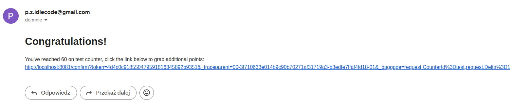
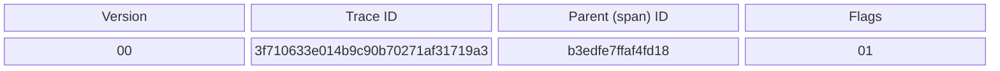
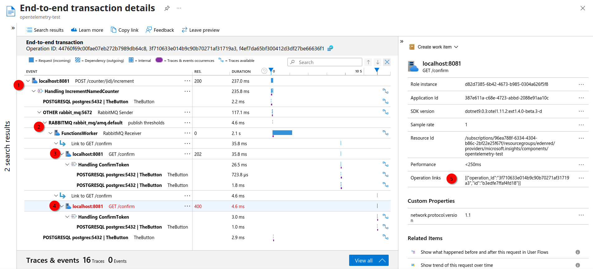

# Propagacja kontekstu: Email



---
hideInToc: true
---
# Propagacja kontekstu: Email

<br/>

<style>
code {
    font-size: 1.5em;
}
</style>

```js
http://localhost:8081/confirm
    ?token=4d4c0c918550479591816345892b9351
    &_traceparent=00-3f710633e014b9c90b70271af31719a3-b3edfe7ffaf4fd18-01
    &_baggage=request.CounterId=test,request.Delta=1
```

<br/>

<v-click>

## 00-3f710633e014b9c90b70271af31719a3-b3edfe7ffaf4fd18-01

</v-click>
<br/>

<v-click>

W3C traceparent - https://www.w3.org/TR/trace-context/



</v-click>

---
hideInToc: true
transition: fade
---

## Propagacja kontekstu: Email - wysyłanie

<<< ../../FunctionsWorker/NotificationsFunction.cs#send-notification {*|6|*}{lines:true, maxHeight: '80%'}

---
hideInToc: true
---

## Propagacja kontekstu: Email - wysyłanie

```csharp
private static readonly TextMapPropagator Propagator = Propagators.DefaultTextMapPropagator;
```

<<< ../../FunctionsWorker/NotificationsFunction.cs#url-enrichement {*|9-14|9-14,17-20|*}{lines:true, maxHeight: '80%'}

<!--
- Jest to przykład manualnej instrumentacji
-->

---
hideInToc: true
---

## Propagacja kontekstu: Email - odbieranie

<<< ../../WebAPI/Telemetry/ContextFromQueryMiddleware.cs#query-context-middleware {*|7|13-17|19|3,20|20,26-30|21|23|*}{lines:true, maxHeight: '85%'}

---


