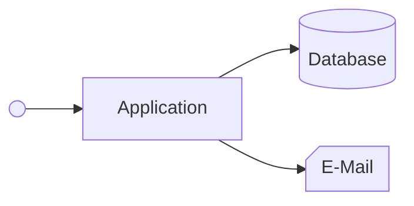
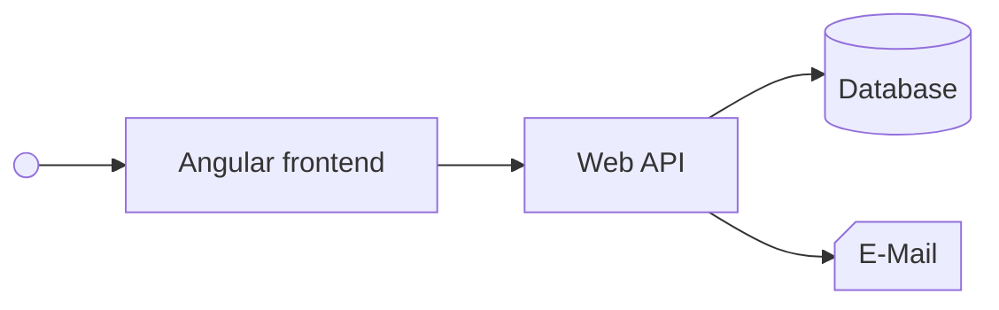
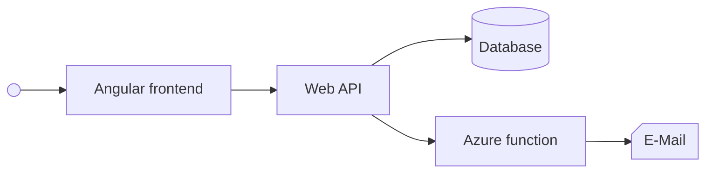
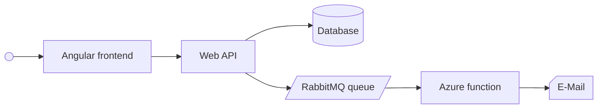
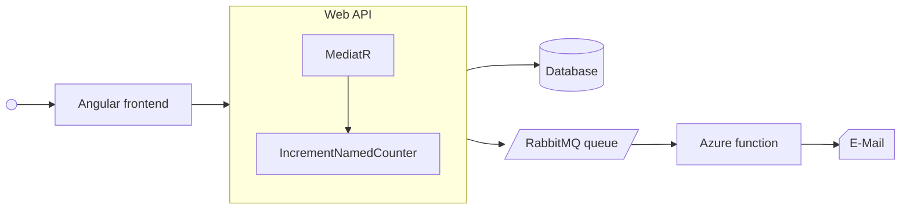

# Projekt demo

<iframe width="100%" height="80%" src="http://localhost:8080/"></iframe>

---
hideInToc: true
transition: fade
---

# Projekt demo

<v-switch>

<template #0>

</template>

<template #1>

</template>

<template #2>

</template>

<template #3>

</template>

<template #4>

</template>

</v-switch>
