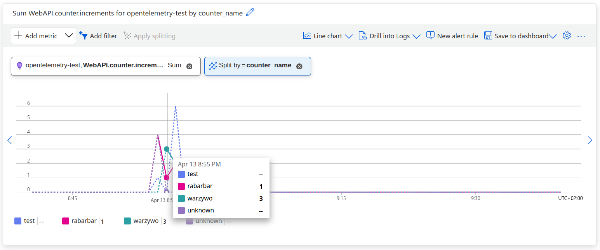

## Metrics
Liczniki reprezentujące aktualny stan systemu

<v-clicks>

- Liczba obsłużonych zapytań
- Poziom użycia pamięci
- Opóźnienia obsługiwanych zapytań

</v-clicks>

<!--
- Statystyki
-->

---
hideInToc: true
---

## .NET Metrics

<v-clicks>
<div>

- `WithMetrics()`: opentelemetry-dotnet SDK subskrybuje się do wskazanych mierników via `.AddMeter()`

</div>

<div>

- Przy starcie tworzone są instrumenty takie jak `Counter`:

```csharp
var meter = meterFactory.Create("WebAPI.counter");
_counterIncrements = meter.CreateCounter<int>("WebAPI.counter.increments");
```

</div>

<div>

- Podczas uruchomienia, kod rejestruje zmiany w mertykach:

```csharp
_counterMetrics.CounterIncrement(counter.Id, request.Delta);
```

```csharp
public void CounterIncrement(string counterName, int delta)
{
    _counterIncrements.Add(delta, new[] { new KeyValuePair<string, object?>("counter_name", counterName) });
}
```

</div>

<div>

- **Procesory** są odpowiedzialne za agregację i filtrowanie metryk

</div>

<div>

- Metryki są zbierane co 10 sekund, a pote **eksportowane**
  - `PrometheusExporter` używa metody pull - via `/metrics` endpoint

</div>

</v-clicks>

<!--
- Metryki są zapisywane w pamięci
- AddMeter == AddSource
- Jeden miernik, wiele instrumentów
- Metryki używane są często w kodzie gdzie wymagana jest wydajność i nie potrzebujemy dokładnej precyzji kiedy zostały one wygenerowane
-->

---
transition: fade
hideInToc: true
---

## Metric

<v-clicks>

|                       |                                      |
|----------------------:|:-------------------------------------|
|       **Metric name** | Nazwa metryki                        |
|        **Attributes** | Wymiary                              |
|             **Value** | Wartość                              |
|   Unit of measurement | Jednostka wartości                   |
| Instrumentation scope | Nazwa miernika                       |
|              Resource | Serwis/środowisko generujący metrykę |

</v-clicks>

---
transition: fade
hideInToc: true
---

## Metric

|                       |                                                                 |
|----------------------:|:----------------------------------------------------------------|
|       **Metric name** | `WebAPI.counter.increments`                                     |
|        **Attributes** | `counter_name: rabarbar`                                        |
|             **Value** | 12                                                              |
|   Unit of measurement |                                                                 |
| Instrumentation scope | `WebAPI.counter`                                                |
|              Resource | `telemetry.distro.name: Azure.Monitor.OpenTelemetry.AspNetCore` |

---


