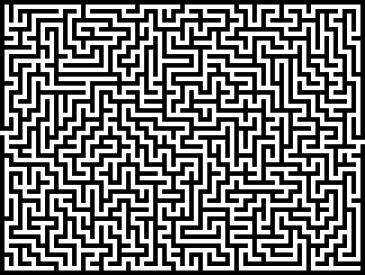

# Czym jest obserwowalność?

 
 

<v-click>

### **Obserwowalność** jest cechą systemu określającą zdolność do zrozumienia jego wewnętrznego stanu (i zachowania) na podstawie danych przez niego generowanych.

</v-click>

 
 

<v-click at="+2">

### By ją osiągnąć, aplikacje muszą być odpowiednio instrumentowane, aby generować **telemetrię**

</v-click>

<v-click>

 
 

> Dobrą instrumentację mamy, gdy nie potrzebujemy dodawać nowej, aby rozwiązywać problemy pojawiające się w aplikacji

</v-click>

---
layout: center
---

<v-switch>
<template #0></template>
<template #1></template>
<template #2></template>
<template #3></template>
</v-switch>
