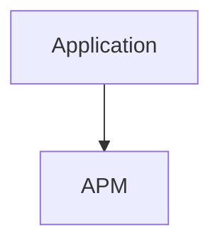
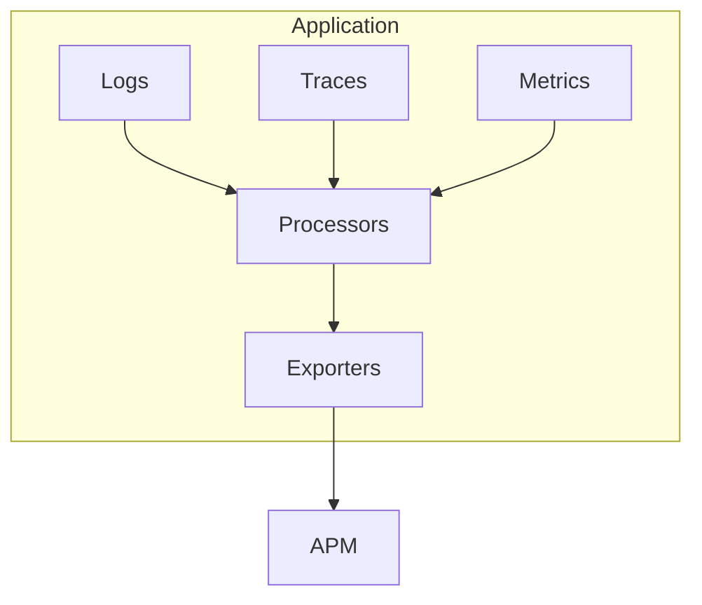
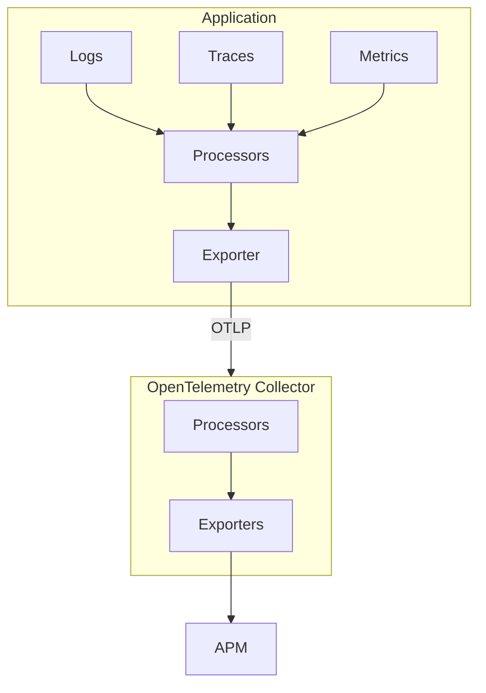
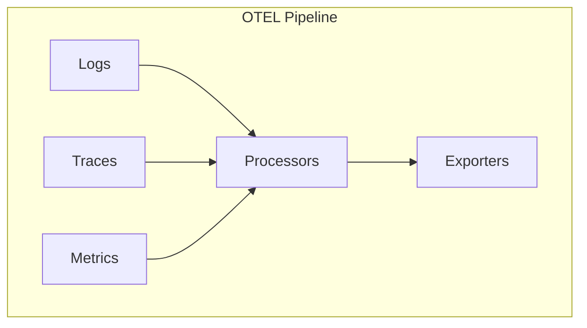

# Składniki OpenTelemetry

<v-clicks depth="2">

- Konwencje nazewnicze
- Wskazówki odnośnie API
- Ekosystem dla poszczególnych języków/środowisk programowania
  - SDK
  - Biblioteki obsługujące najczęściej występujące scenariusze
  - Systemy instrumentacji automatycznej
- Protokół wymiany danych OTLP
- OpenTelemetry Collector - proxy do zbierania/przetwarzania i przekazywania sygnałów dalej

</v-clicks>

<!--
- OpenCensus oraz OpenTracking
- Jest to średnio-sformalizowany standard - RFC
-->

---

# OpenTelemetry Pipeline

<v-switch>

<template #0>

</template>

<template #1>

</template>

<template #2>

</template>

<template #3>

</template>

</v-switch>

