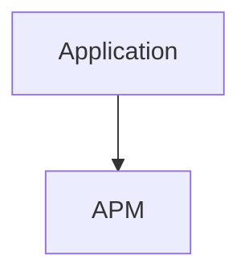
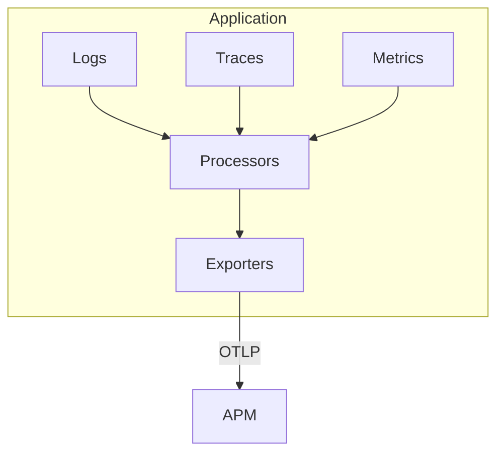
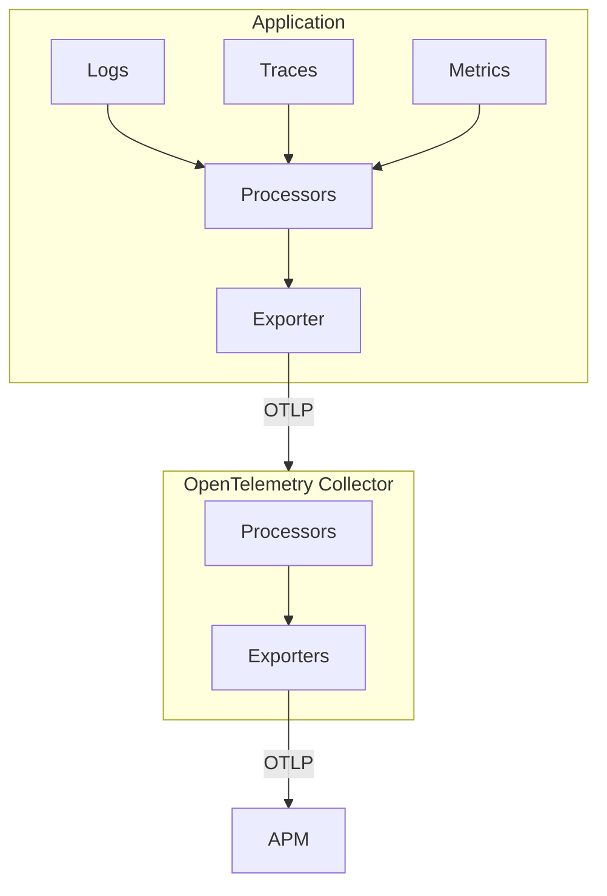
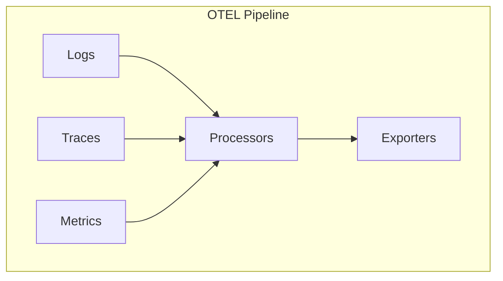

# Składniki OpenTelemetry

<v-clicks>

- Protokół wymiany danych OTLP
- Konwencje nazewnicze
- Wskazówki odnośnie API
- SDK dla poszczególnych języków programowania
- Biblioteki obsługujące najczęściej występujące scenariusze
- Systemy instrumentacji automatycznej
- OpenTelemetry Collector - proxy do zbierania metryk

</v-clicks>

---

# OpenTelemetry Pipeline

<v-switch>

<template #0>

</template>

<template #1>

</template>

<template #2>

</template>

<template #3>

</template>

</v-switch>

