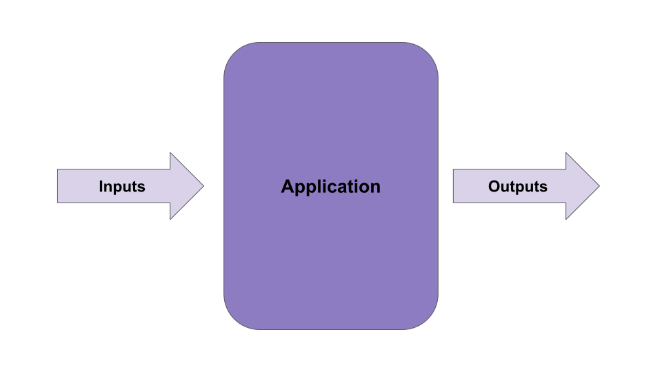
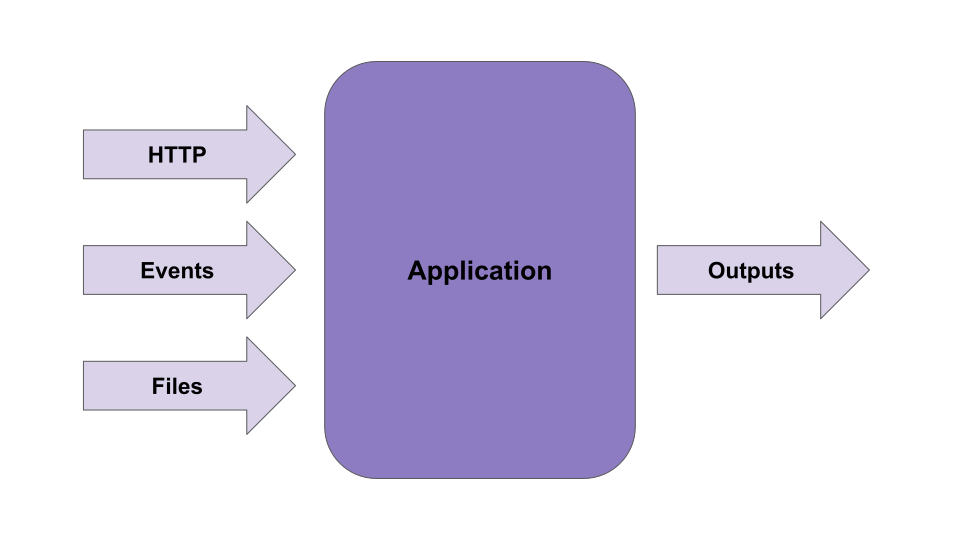
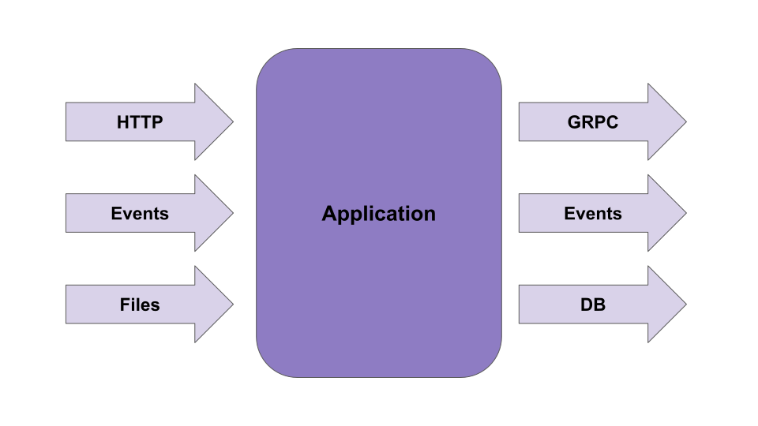
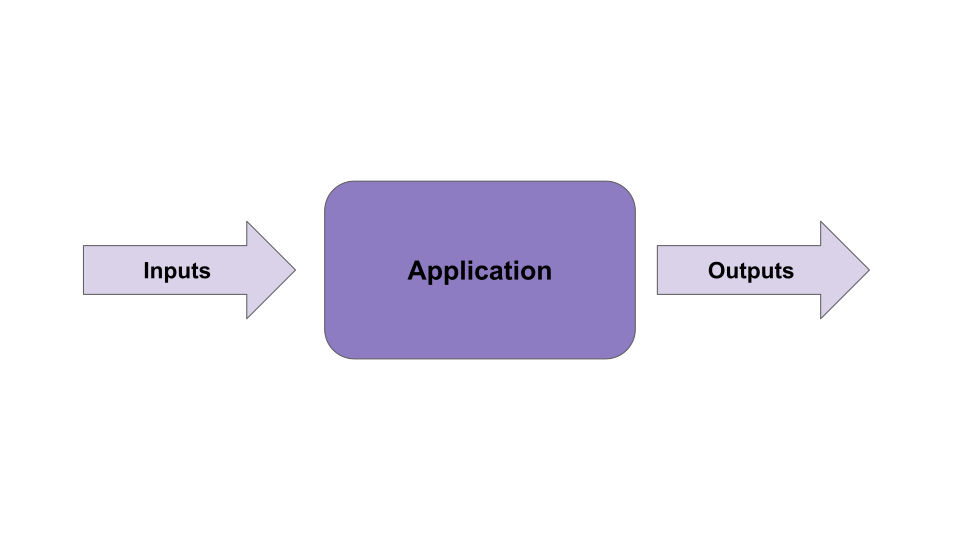
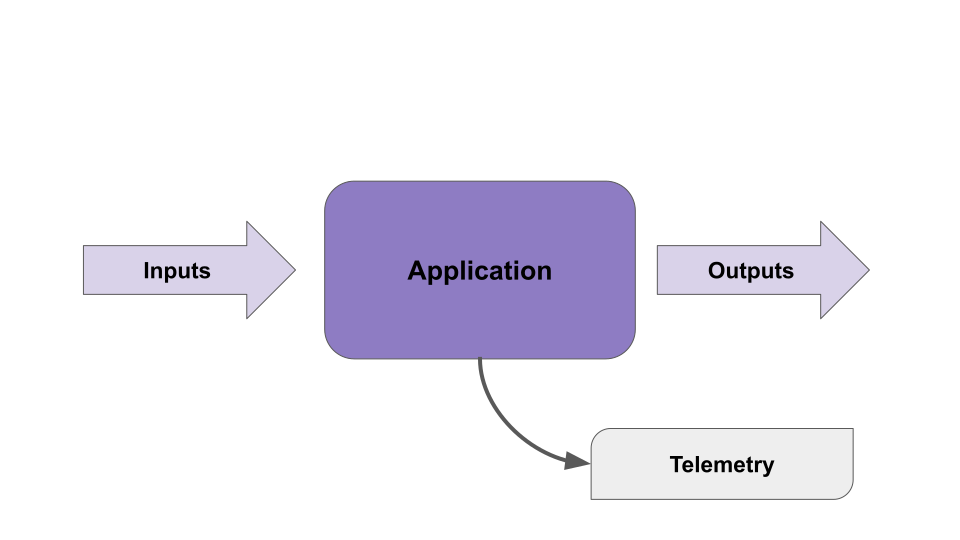

# Czym jest telemetria?

---

<v-switch>
    <template #0></template>
    <template #1></template>
    <template #2></template>
    <template #3></template>
    <template #4></template>
</v-switch>

<!--
- wyjątek bez wejścia - demoscena

[click:3] - w przypadku prostych aplikacji/procesów, wejście, wyjście i kod mogą wystarczyć do zrozumienia
-->
