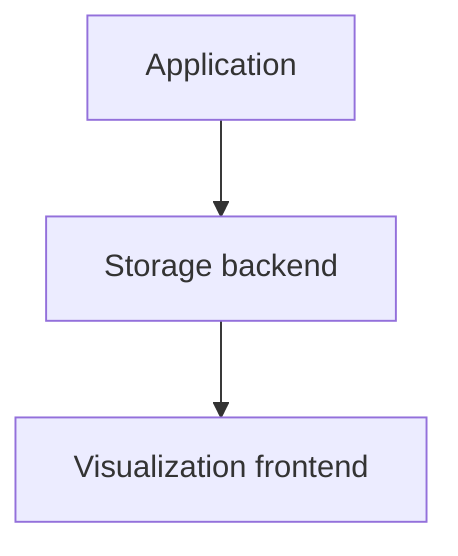
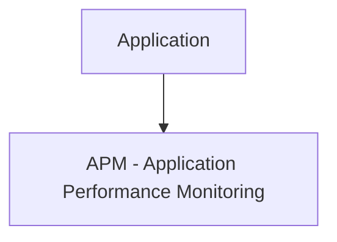
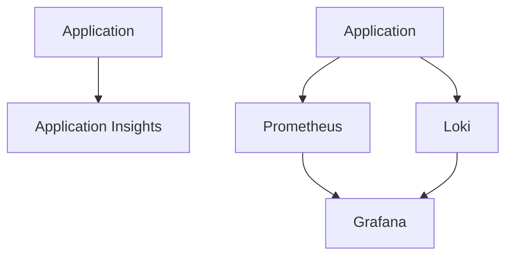

# Dlaczego OpenTelemetry?

<v-switch>

<template #1>

```mermaid
graph TD;
    app["Application"]
    backend["Storage backend"]
    fronted["Visualization frontend"]
    
    app --> backend --> fronted
```

</template>

<template #2>

```mermaid
graph TD;
    app["Application"]
    apm["APM - Application Performance Monitoring"]
    
    app --> apm
```

</template>

<template #3>

```mermaid
graph TD;
    app1["Application"]
    app2["Application"]
    ai["Application Insights"]
    prometheus["Prometheus"]
    loki["Loki"]
    grafana["Grafana"]
    
    app1 --> ai
    
    app2 --> prometheus
    app2 --> loki
    prometheus --> grafana
    loki --> grafana
```

</template>

</v-switch>
