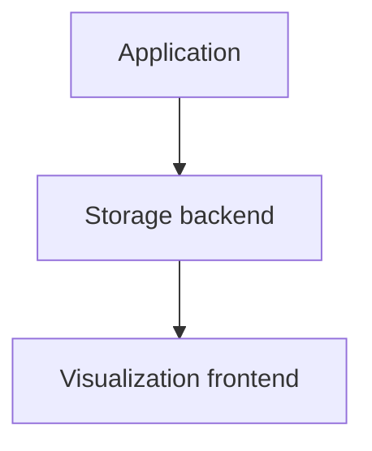
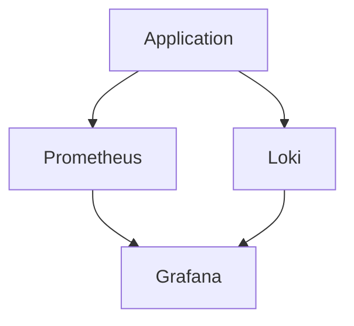
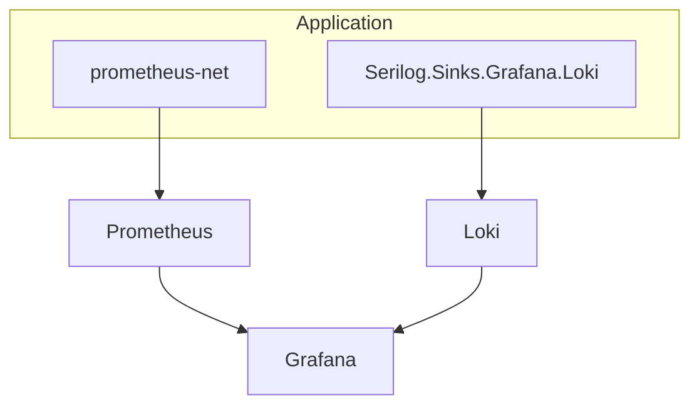
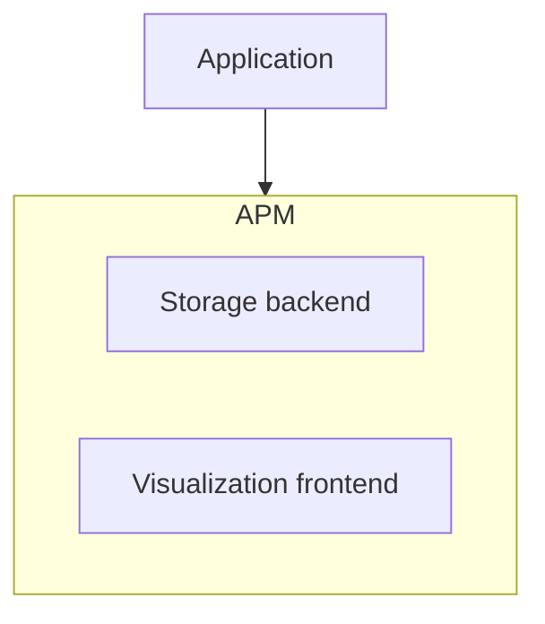
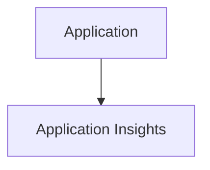
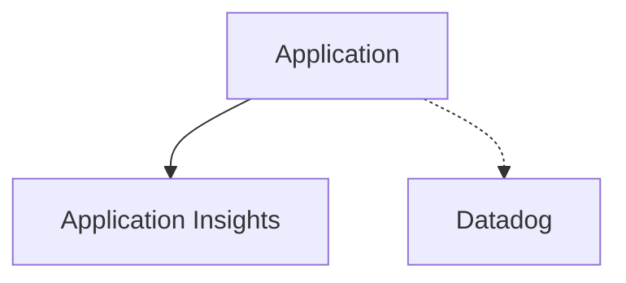
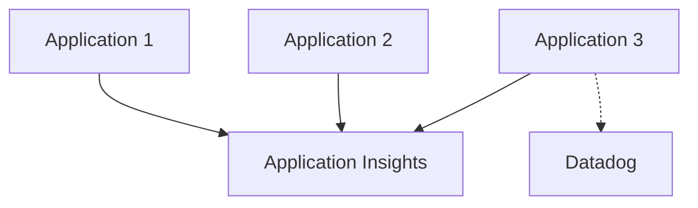
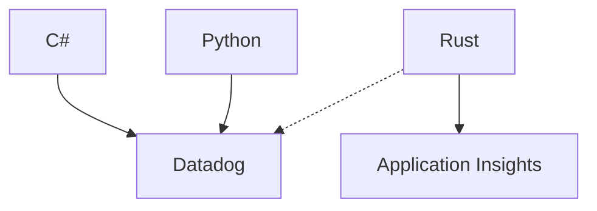
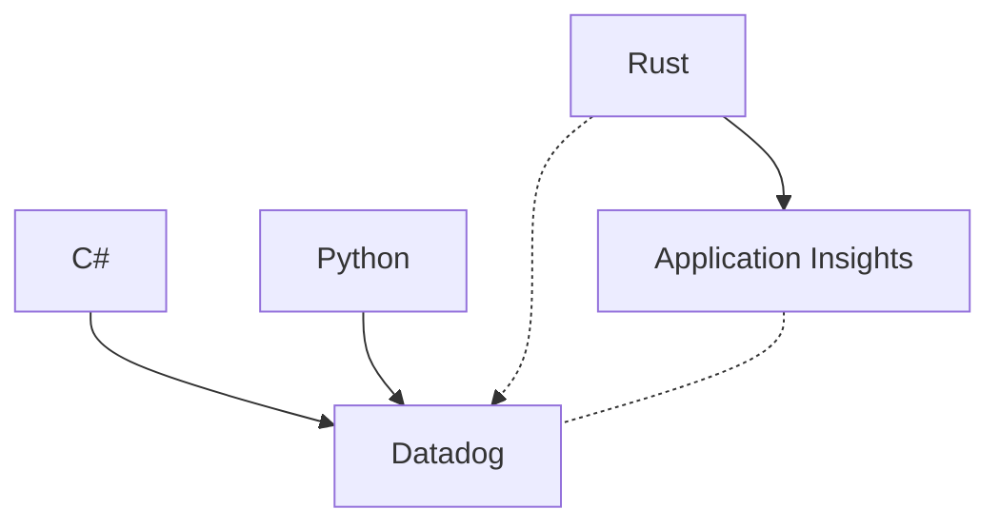
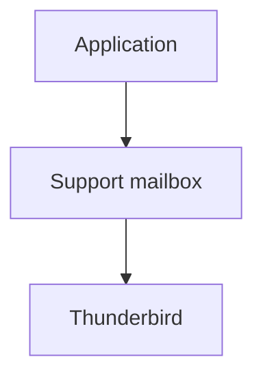

# Dlaczego OpenTelemetry?

<v-switch>

<template #1>
<div align="center">



</div>
</template>

<template #2>
<div align="center">





</div>
</template>

<template #3>
<div align="center">





</div>
</template>

<template #4>
<div align="center">





</div>
</template>

<template #5>
<div align="center">





</div>
</template>

<template #6>
<div align="center">



</div>
</template>

<template #7>
<div align="center">



</div>
</template>


<template #8>
<div align="center">



</div>
</template>


<template #9>
<div align="center">



</div>
</template>

</v-switch>

<!--
- Telemetria nie jest niczym nowym
- APM - Application Performance Monitoring

TODO: Kooperacja wielu systemów
-->

---
hideInToc: true
transition: fade
---

# Bonus: Redneck APM

<v-click>

```csharp {*|1|5-7|9-21|*}{lines: true}
AppDomain.CurrentDomain.UnhandledException += new UnhandledExceptionEventHandler(SendExceptionDetails);

static void SendExceptionDetails(object sender, UnhandledExceptionEventArgs args) 
{
    Exception exception = (Exception)args.ExceptionObject;
    MailMessage error_message = new MailMessage();
    PrepareErrorMessageBody(error_message, exception);
    
    error_message.From = new MailAddress("support@xxx.eu");
    string error_recipients = ConfigurationManager.AppSettings.Get("ErrorReportRecipients");
    foreach (string recipient in error_recipients.Split(';'))
        error_message.To.Add(new MailAddress(recipient));

    SmtpClient smtp_client = new SmtpClient
    {
        Credentials = new System.Net.NetworkCredential("support@xxx.eu", "<the password>"),
        Host = "mail.xxx.eu",
        Port = 25
    };
    
    smtp_client.Send(error_message);
}

```

</v-click>

<!--
Wprowadzenie - system ERP
    - rejestracja nowych pracowników w biurach
    - organizacja zakwaterowania oraz dojazdu do pracy
    - obliczenia godzin pracy, raporty

Cecha: działał lokalnie na komputerach użytkowników, łączył się tylko z bazą danych MySQL
-->

---
hideInToc: true
---

# Bonus: Redneck APM

<div align="center">



</div>
