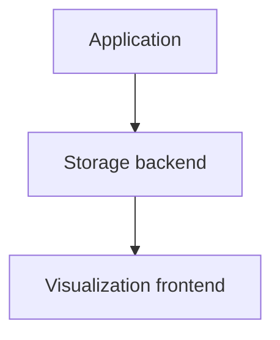
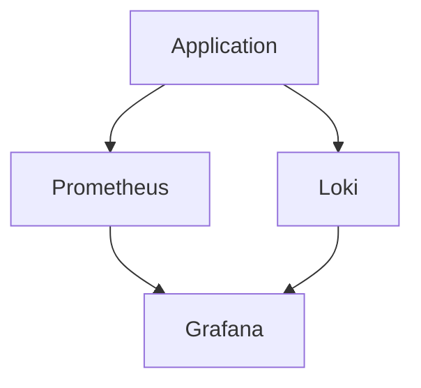
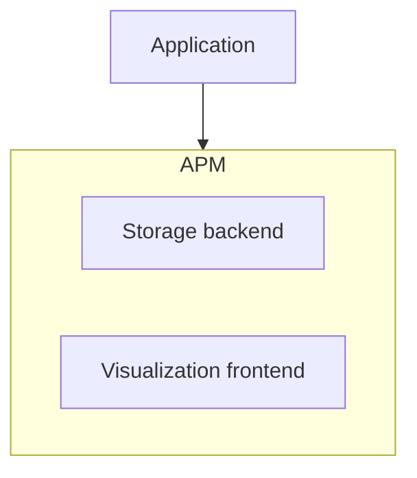
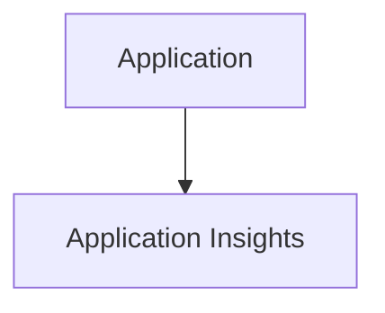

# Dlaczego OpenTelemetry?

<v-switch>

<template #1>
<div align="center">

</div>
</template>

<template #2>
<div align="center">

</div>
</template>


<template #3>
<div align="center">

</div>
</template>

<template #4>
<div align="center">

</div>
</template>

</v-switch>

<!--
- APM - Application Performance Monitoring
-->

---

### Bonus slide: Redneck APM

```csharp
AppDomain.CurrentDomain.UnhandledException += new UnhandledExceptionEventHandler(SendExceptionDetails);

static void SendExceptionDetails(object sender, UnhandledExceptionEventArgs args) 
{
    Exception exception = (Exception)args.ExceptionObject;
    MailMessage error_message = new MailMessage();
    PrepareErrorMessageBody(error_message, exception);
    
    error_message.From = new MailAddress("support@xxx.eu");
    string error_recipients = ConfigurationManager.AppSettings.Get("ErrorReportRecipients");
    foreach (string recipient in error_recipients.Split(';'))
        error_message.To.Add(new MailAddress(recipient));

    SmtpClient smtp_client = new SmtpClient
    {
        Credentials = new System.Net.NetworkCredential("support@xxx.eu", "<the password>"),
        Host = "mail.xxx.eu",
        Port = 25 //587
    };
    
    smtp_client.Send(error_message);
}

```
