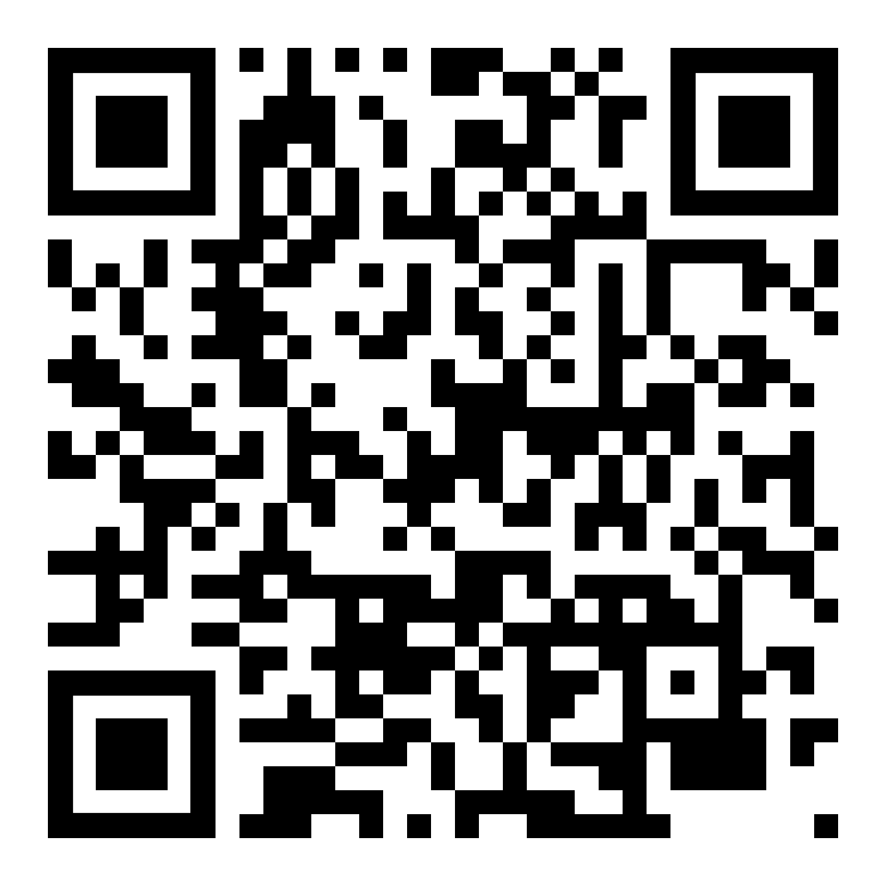

---
# You can also start simply with 'default'
theme: seriph
background: ./cover.jpg
# some information about your slides (markdown enabled)
title: OpenTelemetry w .NET
info: |
  ## Slidev Starter Template
  Presentation slides for developers.

  Learn more at [Sli.dev](https://sli.dev)
# apply unocss classes to the current slide
#class: text-center
# https://sli.dev/features/drawing
drawings:
  persist: false
# slide transition: https://sli.dev/guide/animations.html#slide-transitions
transition: slide-left
# enable MDC Syntax: https://sli.dev/features/mdc
#mdc: true
# open graph
# seoMeta:
#  ogImage: https://cover.sli.dev
---

#  w .NET

**Jak to w zasadzie działa?**

<!--
TODO: Change background to something OTELish.
The last comment block of each slide will be treated as slide notes. It will be visible and editable in Presenter Mode along with the slide. [Read more in the docs](https://sli.dev/guide/syntax.html#notes)
-->

---
transition: fade-out
layout: two-cols
layoutClass: gap-16
---

# Intro

// TODO: Self intro?
 
Demo project 

  <a href="https://github.com/idle-code/OpenTelemetryDemo" target="_blank" class="slidev-icon-btn"><carbon:logo-github /></a>
  <a href="https://github.com/idle-code/OpenTelemetryDemo" target="_blank">github.com/idle-code/OpenTelemetryDemo</a>

::right::

<Toc text-sm minDepth="1" maxDepth="3" />

---
src: ./pages/what-is-observability.md
---

---
src: ./pages/what-is-telemetry.md
---

---
src: ./pages/why-opentelemetry.md
---

---
src: ./pages/what-is-opentelemetry.md
---

---
src: ./pages/demo-project.md
---

---
src: ./pages/otel-dotnet.md
---
